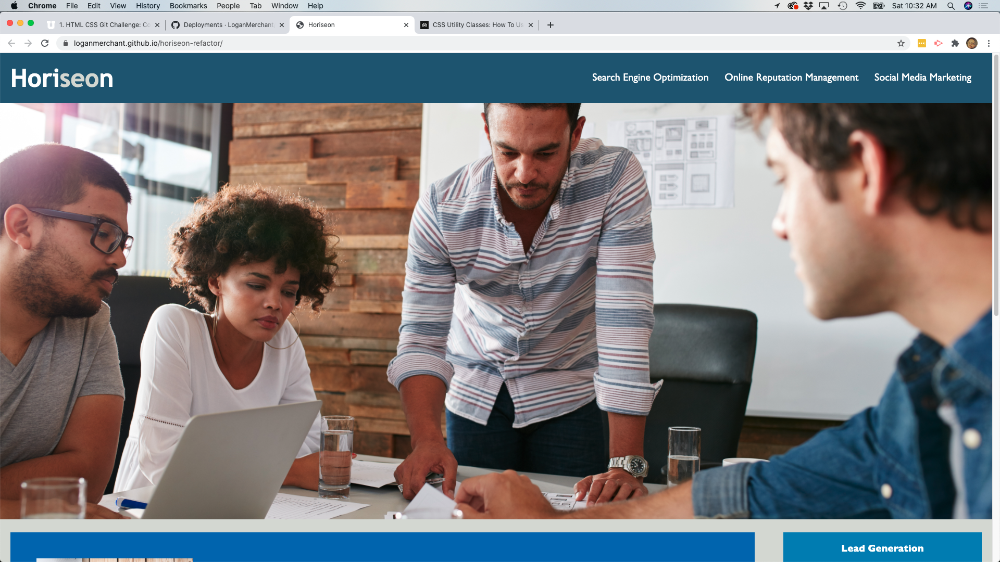
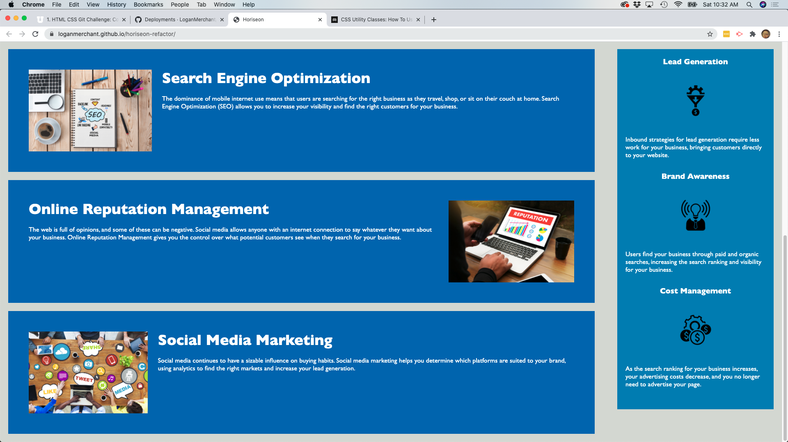

# Refactor of Horiseon Landing Site for Accessibility Purposes

The client (Horiseon) has asked for their landing page to be updated for accessibility and search engine optimization purposes. In order to accomplish this task, I re-evaluated the quality of the HTML and CSS of said landing page and made the following changes:

* Added a more descriptive title for the page.
* Created comments above related sections of HTML and CSS for easier readability.
* Spaced out HTML `div`s more logically.
* Fixed the navigation elements in the header.
* Removed the footer of the page to more closely resemble the client's mock-up.
* Added empty `alt` attributes for all decorative photos in the `Content` and `Benefits` sections.
* Removed unnecessary HTML elements such as `</a>` and `class="seo"`.
* Consolidated CSS rules where necessary.

[I'm an inline-style link with title](https://loganmerchant.github.io/horiseon-refactor/ "Horiseon")